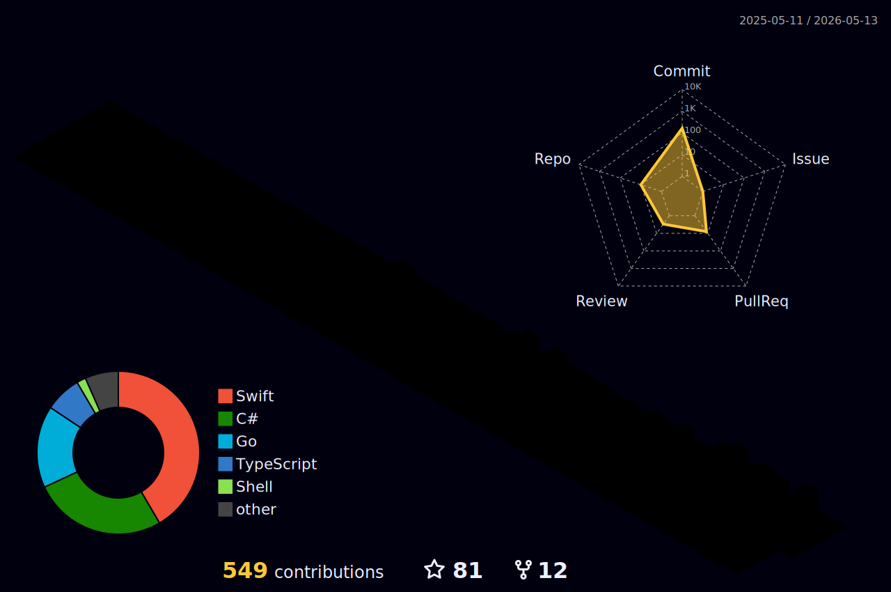

### Hi 👋, you can call me Rossado
I'm a Senior Software Engineer, currently working with Stencil and .Net Core.

#### About me
Hi, I'm Vinícius and I'm living in Tallinn.

<p align="left">  </p>

Currently working with Stencil and .NET Core at a financial company. One of my favorite things to do on my free time (besides playing the guitar) is to build new architectures in order to challenge myself with new development patterns. Besides, one of my hobbies includes learning new stacks, for instance, right now I'm quite interested in Swift.

For the past few years I've also been interested in learning new languages and cultures.

#### Spoken languages
- Portuguese (C2)
- English (C1)
- Italian (A2)
- Estonian (B1) - Learning
- Russian (A1) - Learning
  


 <div>
  <a href="https://github.com/Vinirossado">
  
  
</div>

--- 

### 🏆 GitHub Profile Trophy

<p align="center">
  <a
    href="https://github.com/ryo-ma/github-profile-trophy"
    title="repositório de troféus"
  >
    
  </a>
</p>

---

## ✩ Statistics
<!--START_SECTION:waka-->


**🐱 My GitHub Data** 

> 📦 595.3 kB Used in GitHub's Storage 
 > 
> 🏆 321 Contributions in the Year 2026
 > 
> 🚫 Not Opted to Hire
 > 
> 📜 57 Public Repositories 
 > 
> 🔑 31 Private Repositories 
 > 
**I'm an Early 🐤** 

```text
🌞 Morning                710 commits         ██████░░░░░░░░░░░░░░░░░░░   23.20 % 
🌆 Daytime                1137 commits        █████████░░░░░░░░░░░░░░░░   37.14 % 
🌃 Evening                951 commits         ████████░░░░░░░░░░░░░░░░░   31.07 % 
🌙 Night                  263 commits         ██░░░░░░░░░░░░░░░░░░░░░░░   08.59 % 
```
📅 **I'm Most Productive on Friday** 

```text
Monday                   473 commits         ████░░░░░░░░░░░░░░░░░░░░░   15.45 % 
Tuesday                  394 commits         ███░░░░░░░░░░░░░░░░░░░░░░   12.87 % 
Wednesday                452 commits         ████░░░░░░░░░░░░░░░░░░░░░   14.77 % 
Thursday                 471 commits         ████░░░░░░░░░░░░░░░░░░░░░   15.39 % 
Friday                   519 commits         ████░░░░░░░░░░░░░░░░░░░░░   16.96 % 
Saturday                 380 commits         ███░░░░░░░░░░░░░░░░░░░░░░   12.41 % 
Sunday                   372 commits         ███░░░░░░░░░░░░░░░░░░░░░░   12.15 % 
```


📊 **This Week I Spent My Time On** 

```text
🕑︎ Time Zone: Europe/Tallinn

💬 Programming Languages: 
C#                       2 hrs 49 mins       ███████████░░░░░░░░░░░░░░   43.70 % 
SQL                      2 hrs 17 mins       █████████░░░░░░░░░░░░░░░░   35.47 % 
HTML                     1 hr 20 mins        █████░░░░░░░░░░░░░░░░░░░░   20.58 % 
Markdown                 0 secs              ░░░░░░░░░░░░░░░░░░░░░░░░░   00.25 % 

💻 Operating System: 
Mac                      6 hrs 29 mins       █████████████████████████   100.00 % 
```

**I Mostly Code in C#** 

```text
C#                       30 repos            ████████░░░░░░░░░░░░░░░░░   32.97 % 
TypeScript               16 repos            ████░░░░░░░░░░░░░░░░░░░░░   17.58 % 
Swift                    8 repos             ██░░░░░░░░░░░░░░░░░░░░░░░   08.79 % 
JavaScript               4 repos             █░░░░░░░░░░░░░░░░░░░░░░░░   04.40 % 
Bicep                    1 repo              ░░░░░░░░░░░░░░░░░░░░░░░░░   01.10 % 
```


 Last Updated on 01/06/2026 00:59:54 UTC
<!--END_SECTION:waka-->

#### Technologies of Interest
<div align="center">
  <table>
    <tr>
      <td align="center" width="96">
        <a href="https://github.com/vinirossado?tab=repositories&q=&type=&language=c%23">
          
        </a>
        <br>.NET Core
      </td>
      <td align="center" width="96">
        <a href="https://github.com/vinirossado?tab=repositories&q=&type=&language=c%23">
          
        </a>
        <br>C#
      </td>
      <td align="center" width="96">
        <a href="https://github.com/vinirossado?tab=repositories&q=&type=&language=typescript">
          
        </a>
        <br>Angular
      </td>
      <td align="center" width="96">
        <a href="https://github.com/vinirossado?tab=repositories&q=&type=&language=typescript">
          
        </a>
        <br>TypeScript
      </td>
    </tr>
    <tr>
      <td align="center" width="96">
        <a href="https://github.com/vinirossado?tab=repositories&q=&type=&language=go">
          
        </a>
        <br>Go
      </td>
      <td align="center" width="96">
        <a href="https://github.com/vinirossado?tab=repositories&q=&type=&language=javascript">
          
        </a>
        <br>Node.js
      </td>
      <td align="center" width="96">
        <a href="https://github.com/vinirossado?tab=repositories&q=&type=&language=swift">
          
        </a>
        <br>Swift
      </td>
      <td align="center" width="96">
        <a href="https://github.com/vinirossado?tab=repositories&q=&type=&language=swift">
          
        </a>
        <br>SwiftUI
      </td>
    </tr>
  </table>
</div>
  
  ##
 
<div> 
  <a href="https://instagram.com/vinirossado" target="_blank"></a>
 	<a href="https://www.twitch.tv/vrossado2" target="_blank"></a>
  <a href = "mailto:vinirossado@gmail.com"></a>
  <a href="https://www.linkedin.com/in/viniciusrossado/" target="_blank"></a> 
  <a href="https://vinirossado.github.io/" target="_blank"></a> 
  
</div>

[angular_link]: https://github.com/vinirossado?tab=repositories&q=&type=&language=typescript
[golang_link]: https://github.com/vinirossado?tab=repositories&q=&type=&language=go
[nodejs_link]: https://github.com/vinirossado?tab=repositories&q=&type=&language=javascript
[csharp_link]: https://github.com/vinirossado?tab=repositories&q=&type=&language=c%23
[swift_link]: https://github.com/yourusername?tab=repositories&q=swift
[swiftui_link]: https://github.com/yourusername?tab=repositories&q=swiftui

