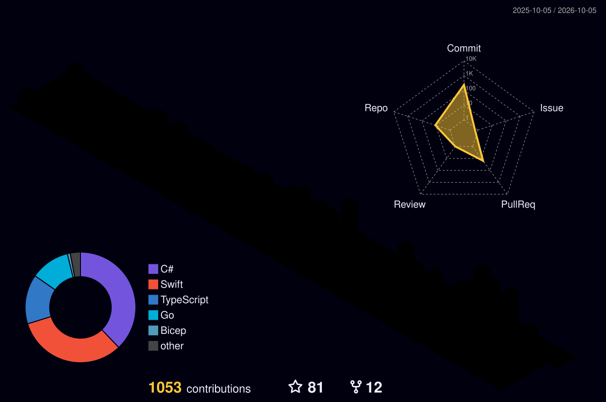

### Hi 👋, you can call me Rossado
I'm a Senior Software Engineer, currently working with .Net Core.

#### About me
Hi, I'm Vinícius and I'm living in Aarhus.

<p align="left">  </p>

Currently working with .NET at a toy manufacturer. One of my favorite things to do on my free time (besides playing the guitar) is to build new architectures in order to challenge myself with new development patterns. Besides, one of my hobbies includes learning new stacks, for instance, right now I'm quite interested in Swift.

For the past few years I've also been interested in learning new languages and cultures.

#### Spoken languages
- Portuguese (C2)
- English (C1)
- Italian (A2)
- Estonian (B1) - Learning
- Russian (A1) - Learning
  


 <div>
  <a href="https://github.com/Vinirossado">
  
  
</div>

--- 

### 🏆 GitHub Profile Trophy

<p align="center">
  <a
    href="https://github.com/ryo-ma/github-profile-trophy"
    title="repositório de troféus"
  >
    
  </a>
</p>

---

## ✩ Statistics
<!--START_SECTION:waka-->


**🐱 My GitHub Data** 

> 📦 629.3 kB Used in GitHub's Storage 
 > 
> 🏆 831 Contributions in the Year 2026
 > 
> 🚫 Not Opted to Hire
 > 
> 📜 61 Public Repositories 
 > 
> 🔑 34 Private Repositories 
 > 
**I'm an Early 🐤** 

```text
🌞 Morning                2534 commits        ████████░░░░░░░░░░░░░░░░░   32.54 % 
🌆 Daytime                2329 commits        ███████░░░░░░░░░░░░░░░░░░   29.90 % 
🌃 Evening                2753 commits        █████████░░░░░░░░░░░░░░░░   35.35 % 
🌙 Night                  172 commits         █░░░░░░░░░░░░░░░░░░░░░░░░   02.21 % 
```
📅 **I'm Most Productive on Monday** 

```text
Monday                   2039 commits        ███████░░░░░░░░░░░░░░░░░░   26.18 % 
Tuesday                  1131 commits        ████░░░░░░░░░░░░░░░░░░░░░   14.52 % 
Wednesday                1070 commits        ███░░░░░░░░░░░░░░░░░░░░░░   13.74 % 
Thursday                 746 commits         ██░░░░░░░░░░░░░░░░░░░░░░░   09.58 % 
Friday                   679 commits         ██░░░░░░░░░░░░░░░░░░░░░░░   08.72 % 
Saturday                 497 commits         ██░░░░░░░░░░░░░░░░░░░░░░░   06.38 % 
Sunday                   1626 commits        █████░░░░░░░░░░░░░░░░░░░░   20.88 % 
```


📊 **This Week I Spent My Time On** 

```text
🕑︎ Time Zone: Europe/Copenhagen

💬 Programming Languages: 
F#                       4 hrs 54 mins       ████████████░░░░░░░░░░░░░   48.95 % 
Markdown                 1 hr 14 mins        ███░░░░░░░░░░░░░░░░░░░░░░   12.33 % 
JSON                     1 hr 7 mins         ███░░░░░░░░░░░░░░░░░░░░░░   11.23 % 
Other                    39 mins             ██░░░░░░░░░░░░░░░░░░░░░░░   06.47 % 
SQL                      32 mins             █░░░░░░░░░░░░░░░░░░░░░░░░   05.46 % 

💻 Operating System: 
Mac                      10 hrs 2 mins       █████████████████████████   100.00 % 
```

🤖 **AI Coding This Week** 

```text
⏱ AI Coding Time: 6 hrs 16 mins (62.4%)

✍️ 6,502 lines written by AI, 82 lines written by hand (98.75% AI-written)

🔤 7,216,292 Input Tokens, 405,334 Output Tokens

💵 $174.94 Estimated AI Cost This Week

🧠 16 AI Sessions, 105 AI Prompts

Opus                     6,543 lines         █████████████████████████   100.00 % 
Opencode-Cli             0 lines             ░░░░░░░░░░░░░░░░░░░░░░░░░   00.00 % 
Github-Copilot           0 lines             ░░░░░░░░░░░░░░░░░░░░░░░░░   00.00 % 

🔎 AI Coding Insights:
🤖 AI-Driven — 98.75% of written lines came from AI
📝 Concise Prompter — average 162 characters per prompt
🔁 Iterative Prompter — average 7 prompts per session
🚀 High AI Trust — 4.18% of changed lines were hand-edited
```

**I Mostly Code in C#** 

```text
TypeScript               17 repos            ████░░░░░░░░░░░░░░░░░░░░░   17.53 % 
Swift                    10 repos            ███░░░░░░░░░░░░░░░░░░░░░░   10.31 % 
Java                     3 repos             █░░░░░░░░░░░░░░░░░░░░░░░░   03.09 % 
F#                       1 repo              ░░░░░░░░░░░░░░░░░░░░░░░░░   01.03 % 
Rust                     1 repo              ░░░░░░░░░░░░░░░░░░░░░░░░░   01.03 % 
```


 Last Updated on 10/10/2026 04:34:59 UTC
<!--END_SECTION:waka-->

#### Technologies of Interest
<div align="center">
  <table>
    <tr>
      <td align="center" width="96">
        <a href="https://github.com/vinirossado?tab=repositories&q=&type=&language=c%23">
          
        </a>
        <br>.NET Core
      </td>
      <td align="center" width="96">
        <a href="https://github.com/vinirossado?tab=repositories&q=&type=&language=c%23">
          
        </a>
        <br>C#
      </td>
         <td align="center" width="96">
        <a href="https://github.com/vinirossado?tab=repositories&q=&type=&language=f%23">
          
        </a>
        <br>F#
      </td>
       <td align="center" width="96">
        <a href="https://github.com/vinirossado?tab=repositories&q=&type=&language=go">
          
        </a>
        <br>Go
      </td>
      <td align="center" width="96">
        <a href="https://github.com/vinirossado?tab=repositories&q=&type=&language=swift">
          
        </a>
        <br>Swift
      </td>
        <td align="center" width="96">
        <a href="https://martendb.io">
          
        </a>
        <br>Marten
        </td>   
    </tr>
    <tr>
      <td align="center" width="96">
        <a href="https://github.com/vinirossado?tab=repositories&q=&type=&language=typescript">
          
        </a>
        <br>Angular
      </td>
      <td align="center" width="96">
        <a href="https://github.com/vinirossado?tab=repositories&q=&type=&language=typescript">
          
        </a>
        <br>TypeScript
      </td>
      <td align="center" width="96">
        <a href="https://github.com/vinirossado?tab=repositories&q=&type=&language=swift">
          
        </a>
        <br>SwiftUI
      </td>
       <td align="center" width="96">
        <a href="https://jena.apache.org/documentation/fuseki2/">
          
        </a>
        <br>Fuseki
      </td>
      <td align="center" width="96">
        <a href="https://github.com/vinirossado?tab=repositories&q=&type=&language=sparql">
          
        </a>
        <br>SPARQL
      </td>
      <td align="center" width="96">
        <a href="https://github.com/vinirossado?tab=repositories&q=&type=&language=turtle">
          
        </a>
        <br>TTL (Turtle)
      </td>
    </tr>
  </table>
</div>
 
   ##
   
<div> 
  <a href="https://instagram.com/vinirossado" target="_blank"></a>
 	<a href="https://www.twitch.tv/vrossado2" target="_blank"></a>
  <a href = "mailto:vinirossado@gmail.com"></a>
  <a href="https://www.linkedin.com/in/viniciusrossado/" target="_blank"></a> 
  <a href="https://vinirossado.github.io/" target="_blank"></a> 
  
</div>

[angular_link]: https://github.com/vinirossado?tab=repositories&q=&type=&language=typescript
[golang_link]: https://github.com/vinirossado?tab=repositories&q=&type=&language=go
[nodejs_link]: https://github.com/vinirossado?tab=repositories&q=&type=&language=javascript
[csharp_link]: https://github.com/vinirossado?tab=repositories&q=&type=&language=c%23
[swift_link]: https://github.com/yourusername?tab=repositories&q=swift
[swiftui_link]: https://github.com/yourusername?tab=repositories&q=swiftui

