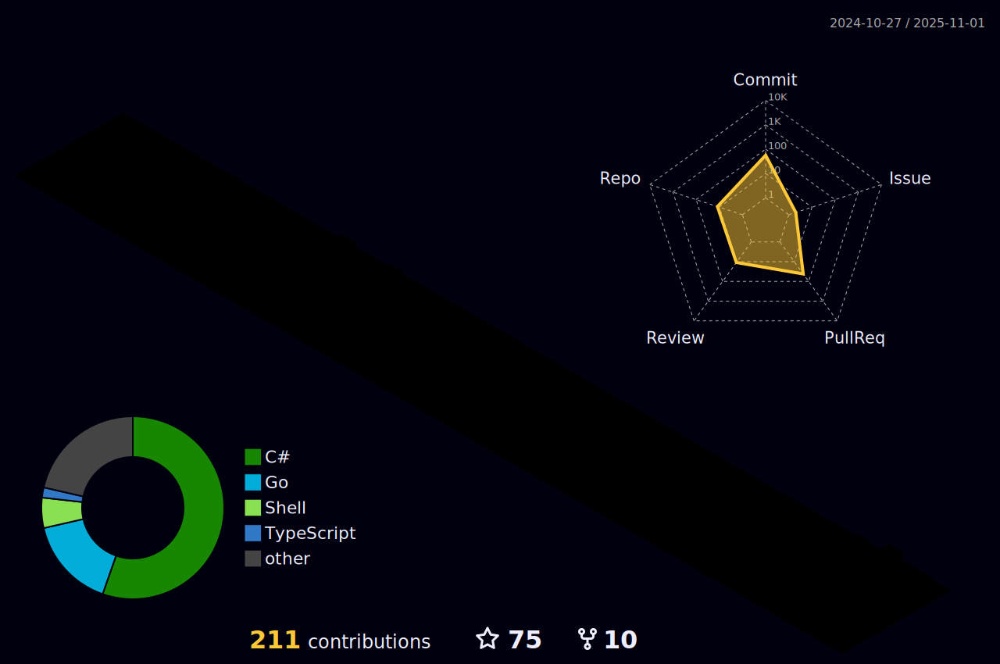

### Hi 👋, you can call me Rossado
I'm a Senior Software Engineer, currently working with Stencil and .Net Core.

#### About me
Hi, I'm Vinícius and I'm living in Tallinn.

<p align="left">  </p>

Currently working with Stencil and .NET Core at a financial company. One of my favorite things to do on my free time (besides playing the guitar) is to build new architectures in order to challenge myself with new development patterns. Besides, one of my hobbies includes learning new stacks, for instance, right now I'm quite interested in Golang.

For the past few years I've also been interested in learning new languages and cultures.

#### Spoken languages
- Portuguese (C2)
- English (C1)
- Italian (A2)
- Estonian (B1) - Learning
- Russian (A1) - Learning
  


 <div>
  <a href="https://github.com/Vinirossado">
  
  
</div>

--- 

### 🏆 GitHub Profile Trophy

<p align="center">
  <a
    href="https://github.com/ryo-ma/github-profile-trophy"
    title="repositório de troféus"
  >
    
  </a>
</p>

---

## ✩ Statistics
<!--START_SECTION:waka-->


**🐱 My GitHub Data** 

> 📦 545.9 kB Used in GitHub's Storage 
 > 
> 🏆 113 Contributions in the Year 2025
 > 
> 🚫 Not Opted to Hire
 > 
> 📜 53 Public Repositories 
 > 
> 🔑 19 Private Repositories 
 > 
**I'm an Early 🐤** 

```text
🌞 Morning                311 commits         █████░░░░░░░░░░░░░░░░░░░░   20.87 % 
🌆 Daytime                489 commits         ████████░░░░░░░░░░░░░░░░░   32.82 % 
🌃 Evening                541 commits         █████████░░░░░░░░░░░░░░░░   36.31 % 
🌙 Night                  149 commits         ██░░░░░░░░░░░░░░░░░░░░░░░   10.00 % 
```
📅 **I'm Most Productive on Thursday** 

```text
Monday                   188 commits         ███░░░░░░░░░░░░░░░░░░░░░░   12.62 % 
Tuesday                  176 commits         ███░░░░░░░░░░░░░░░░░░░░░░   11.81 % 
Wednesday                234 commits         ████░░░░░░░░░░░░░░░░░░░░░   15.70 % 
Thursday                 336 commits         ██████░░░░░░░░░░░░░░░░░░░   22.55 % 
Friday                   237 commits         ████░░░░░░░░░░░░░░░░░░░░░   15.91 % 
Saturday                 136 commits         ██░░░░░░░░░░░░░░░░░░░░░░░   09.13 % 
Sunday                   183 commits         ███░░░░░░░░░░░░░░░░░░░░░░   12.28 % 
```


📊 **This Week I Spent My Time On** 

```text
🕑︎ Time Zone: Europe/Tallinn

💬 Programming Languages: 
C#                       14 hrs 9 mins       ████████████░░░░░░░░░░░░░   49.88 % 
Swift                    10 hrs 59 mins      ██████████░░░░░░░░░░░░░░░   38.68 % 
TypeScript               1 hr 8 mins         █░░░░░░░░░░░░░░░░░░░░░░░░   04.01 % 
HTTP Request             1 hr 5 mins         █░░░░░░░░░░░░░░░░░░░░░░░░   03.83 % 
Other                    27 mins             ░░░░░░░░░░░░░░░░░░░░░░░░░   01.59 % 

💻 Operating System: 
Mac                      28 hrs 23 mins      █████████████████████████   100.00 % 
```

**I Mostly Code in C#** 

```text
C#                       27 repos            █████████░░░░░░░░░░░░░░░░   36.49 % 
Go                       17 repos            ██████░░░░░░░░░░░░░░░░░░░   22.97 % 
TypeScript               14 repos            █████░░░░░░░░░░░░░░░░░░░░   18.92 % 
Swift                    2 repos             █░░░░░░░░░░░░░░░░░░░░░░░░   02.70 % 
Jupyter Notebook         1 repo              ░░░░░░░░░░░░░░░░░░░░░░░░░   01.35 % 
```


 Last Updated on 17/06/2025 00:24:13 UTC
<!--END_SECTION:waka-->

#### Technologies of Interest
<div style="display: inline_block"><br>

[][csharp_link]
[][csharp_link]
[][angular_link]
[][angular_link]
[][golang_link]
[][nodejs_link]

</div>

  
  ##
 
<div> 
  <a href="https://instagram.com/vinirossado" target="_blank"></a>
 	<a href="https://www.twitch.tv/vrossado2" target="_blank"></a>
  <a href = "mailto:vinirossado@gmail.com"></a>
  <a href="https://www.linkedin.com/in/viniciusrossado/" target="_blank"></a> 
  <a href="https://vinirossado.github.io/" target="_blank"></a> 
  
</div>

[angular_link]: https://github.com/vinirossado?tab=repositories&q=&type=&language=typescript
[golang_link]: https://github.com/vinirossado?tab=repositories&q=&type=&language=go
[nodejs_link]: https://github.com/vinirossado?tab=repositories&q=&type=&language=javascript
[csharp_link]: https://github.com/vinirossado?tab=repositories&q=&type=&language=c%23
